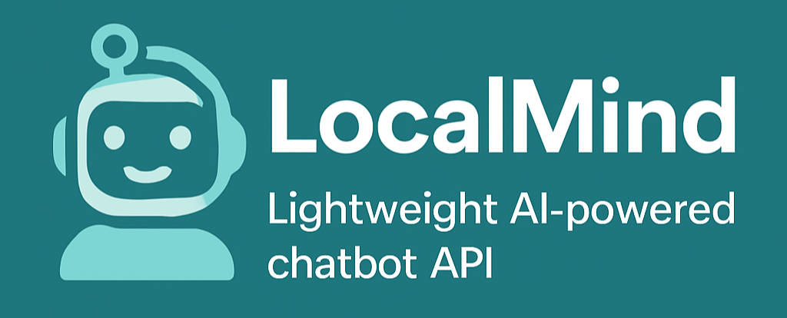

<p align="center">
  
</p>

---
sdk: docker
title: LocalMind
short_description: Lightweight AI-powered chatbot API – self-hosted and free
---
🤖 TinyLlama Chatbot API

A lightweight chatbot API powered by TinyLlama-1.1B-Chat, deployed for free using Hugging Face Spaces.

> 🔗 Live API Endpoint:  
https://harshkumarsaw-chatbot.hf.space/chat

---

📦 Features

- Lightweight transformer model (1.1B parameters)
- Simple, stateless API
- Free hosting via Hugging Face Spaces
- Supports multi-turn conversations with history

---

🚀 Quickstart

🧪 Test the API

Send a POST request to:

    https://harshkumarsaw-chatbot.hf.space/chat

Request Body (JSON):

```
{
"message": "how are you feeling today?",
"history": []
}

```

Response:

```
{
"response": "I'm feeling great! How about you?",
"history": [
["how are you feeling today?", "I'm feeling great! How about you?"]
]
}

```

✅ You can pass the history array back in the next request to continue the same conversation.

---

📡 How to Use in Python

```
import requests

url = "https://harshkumarsaw-chatbot.hf.space/chat"
payload = {
"message": "Tell me a joke",
"history": []
}

res = requests.post(url, json=payload)
print(res.json()["response"])

```
